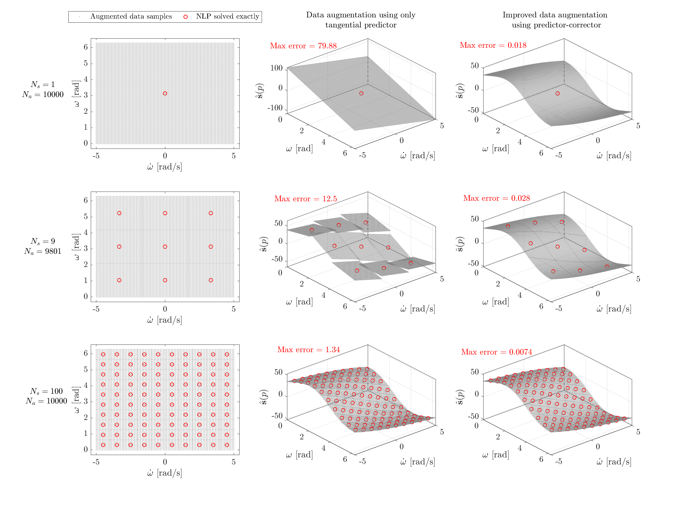

# Sensitivity-DataAugmentation
 Sensitivity-based Data Augmentation framework for optimal control problems.
 
  Examples:
   * 2-state Continous-Stirred Tank Reactor (CSTR) process
   * Inverted pendulum
   * Building climate control 
   * ...
   
 
 Example: Sensitivity-based data augmentation for the inverted pendulum example

See the preprint and the slides in this repository for more detailed infromation. 
